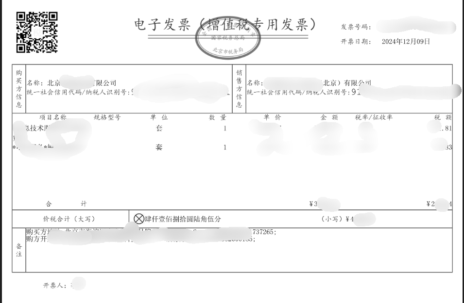

# 简介
本工具用来提取电子发票信息。
只支持文字型pdf。
只支持电子发票，它的格式如下：

# 使用说明
`
pip install wechat-ocr PyMuPDF
`

## 运行
1. 把发票放到本工程发票文件夹(如果没有则新建一个名为发票的文件夹)下。 然后 
`python extract.py`

2. `python extract.py path/to/发票所在的文件夹`

两者任选一种即可

## 输出
输出在outputs文件夹下,每次运行都会以开始运行时间为名在outputs文件夹下新建一个文件夹，存放本次运行的结果
结果包含
1. fa_piao_info.csv  提取到的发票信息
2. all.log  运行时的日志
3. warning.log 运行时的一些警告，这发生在程序执行了一些不是很确定的操作，需要用户稍微检查下
4. error.log  程序没有提取的pdf。这是由于pdf是图片类型的。

注意:fa_piao_info.csv 可能有空值，这些空值是因为程序没有识别到对应的值，需要用户人工提取。空值是低概率事件。程序能够识别大部分数据。